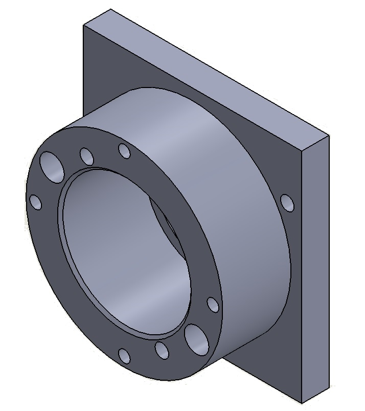

## More information about the parts of the shredder unit
+ Drawing of the shredder unit: [here](drawings/01_00_00-shredder_unit.PDF)

+ The damaged end face milling cutter that is used as rotor/ dynamic blades:
 
	+ Type : Fette Hanseaten 40x55SNF Sp160

	* The spiral form of the blades allows a nearly continous cutting process and helps to prevent shock loads. 

+ The the block for the housing (custom product) that holds the static blades
 
	+ Drawing: [here](drawings/01_02_01-block.PDF)
	* Material: 1.4404 - X 2 CrNiMo 17 13 2
	* The block was printed (selective laser sintering). The previous model was a welded construction but this method caused too many tensions. We also thought about milling and turning but the process would be too complicated (many changes of the fixing).
	* The four static blades are attached to the block by three screws each. This fixing method allows us to adapt the blade position to wear or and to compensate tolarances. In addition an adption to different pellet materials is possible.

+ The counterplate (custom product) that holds the bearings

	+ Drawings: [here](drawings/01_02_02-counterplate.PDF) and [here](drawings/01_02_02-counterplate_DETAILS.PDF)
	+ Material: aluminium
	+ Production method: milling
	+ Bearing: FAG 6005 (radial deep groove ball bearing)
	+ We used a floating bearing arrangement because its cheap and there is no need for low tolearances in the axial movement of the milling cutter.
